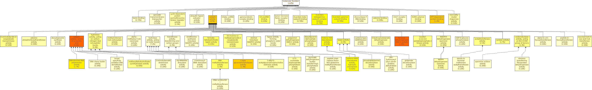
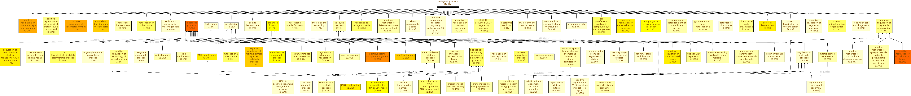
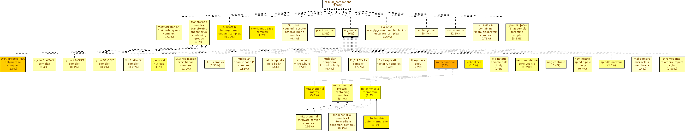

RNA-seq analysis of Drosophila under amino acid starvation — DEGs, GO/KEGG enrichment, and hub gene identification
# Drosophila RNA-Seq Analysis: Amino Acid Starvation Response

RNA-Seq analysis of *Drosophila melanogaster* under amino acid starvation, performed on the Galaxy platform. The workflow covers the complete pipeline from raw reads to differential expression, functional enrichment, and protein–protein interaction (PPI) network analysis.

---

## Overview

This project investigates how *Drosophila melanogaster* responds to amino acid starvation at the gene expression level. RNA-Seq data were analyzed on Galaxy — a browser-based platform that runs a full RNA-Seq pipeline (from raw reads to differential expression) without requiring command-line coding, while following the same standard steps used in command-line workflows.

This project served as my introduction to hands-on RNA-Seq analysis, network analysis, and pathway enrichment.

---

## Research Question

How does amino acid starvation change gene expression in *Drosophila* cells, and which biological processes and pathways are involved in that response?
The 4 datasets od fruit fly under two different conditions were used.
Control: SRR10904051 and SRR10904052  
Amino Acid Starvation: SRR10904053 and SRR10904054  

---

## Methodology

| Step | Tool | Purpose |
|------|------|---------|
| Quality check | FastQC | Confirm raw read quality |
| Alignment | HISAT2 | Map reads to *Drosophila* reference genome |
| Quantification | featureCounts | Count reads per gene |
| Differential expression | DESeq2 | Compare starved vs. control conditions |
| Functional enrichment | GO, KEGG | Identify affected biological processes |
| PPI network | STRING | Build protein interaction network |
| Hub gene analysis | Cytoscape (CytoHubba, MCC) | Identify highly connected hub proteins |

---

## Results

### Differential Expression
Amino acid starvation caused a clear shift in gene expression compared to the control condition, with a set of genes consistently upregulated.
A total of 560 upregulated genes were obtained and these genes were then used for further functional analysis. 
### GO Enrichment
GO enrichment pointed strongly toward **mitochondrial components and functions**, suggesting starvation affects mitochondrial activity and energy metabolism. Terms related to **cell division and meiotic processes** also appeared, hinting at effects on growth and reproductive functions.

- 
- 
- 

### KEGG Pathway Enrichment
KEGG enrichment showed involvement of:
- DNA replication
- RNA polymerase
- Cell cycle
- p53 signaling
- Cytosolic DNA sensing
- Beta-alanine metabolism

This indicates the starvation response is not driven by a single pathway but touches multiple cellular systems simultaneously.

- 

### PPI Network and Hub Genes
The STRING PPI network contained **464 proteins and 1,832 interactions** (confidence score ≥ 0.700), showing that many affected proteins work closely together rather than independently.

Top 10 hub genes identified by Cytoscape (CytoHubba, MCC method):

| Rank | Hub Gene | MCC Score |
|------|----------|-----------|
| 1 | CG11837 | 10,120,486 |
| 2 | CG7246 | 9,825,272 |
| 3 | wcd | 9,753,254 |
| 4 | CG1789 | 9,035,314 |
| 5 | CG6937 | 6,406,504 |
| 6 | Sas10 | 6,307,944 |
| 7 | NHP2 | 6,302,701 |
| 8 | CG9246 | 6,056,887 |
| 9 | l(2)05287 | 5,733,216 |
| 10 | CG4806 | 5,249,736 |

- 
- 

---

## Tools

Galaxy · FastQC · HISAT2 · featureCounts · DESeq2 · STRING · Cytoscape (CytoHubba)

---

## Repository Contents

| Path | Description |
|------|-------------|
| `workflow/galaxy_workflow.ga` | Complete Galaxy workflow |
| `scripts/kegg_enrichment.R` | R script for KEGG enrichment |
| `results/degs/` | Differential expression results |
| `results/go_enrichment/` | GO enrichment tables (MF, BP, CC) |
| `figures/` | All visualizations |
| `report/RNAseq_Drosophila_report.pdf` | Full written report |

---

## Limitations

- The analysis used only **two biological replicates**, which limits statistical power but only two replicates were available on NCBI under this condition.
- GO, KEGG, and PPI findings are based on existing annotations and predicted interactions. They point to interesting candidate genes and pathways but require experimental follow-up to confirm biological roles.

---

## A Note on the Approach

This analysis was performed entirely through Galaxy's GUI rather than the command line. I have since moved on to running similar pipelines directly in **Linux/bash** for greater control and reproducibility — see my other repositories for examples.

---

## Author

**Mahrukh Jamil**  
BS Bioinformatics  
GitHub: [@Mahrukhjamil-alt](https://github.com/Mahrukhjamil-alt)

---

## License

This project is licensed under the MIT License — see the [LICENSE](LICENSE) file for details.
